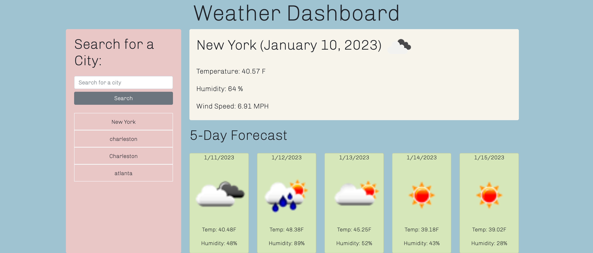

# weather-dashboard
Simple weather dashboard using API's

## Description
This is a simple weather dashboard that uses API's. The user is presented with a weather dashboard containing a form input to search a city. When the city is searched, then you are presented with current and future conditions for that city. That city is also added to the search history. When the city is presented, there is also the date, an icon representing the waether conditions, the temperature, humidity, and wind speed. Within the 5-day forecast are dates, icons representing the weather condition for that day, the temperature, wind speed, and humidity for each day. Lastly, when you click on a city in the search history, then you are again rpesented with the current and future conditions for that city. 

## Visuals/Screenshot
Screenshot below showing the current and 5-day forecast along with the saved search history in the left column. 

## Installation

Open your default browser with the following link:

https://hannahsvaughan.github.io/weather-dashboard/

